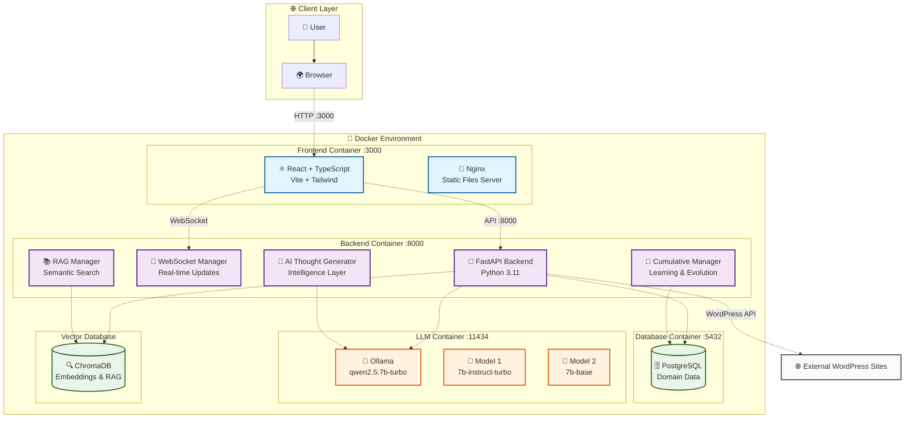

# 🔗 Blink - AI-Powered SEO Platform

> Мировая платформа для SEO-инженеров с искусственным интеллектом и современными технологиями


## 🚀 Что нового в Blink 4.0.0

### 🔥 Мажорный рефакторинг
- **Полная переработка архитектуры** - удалены все legacy-компоненты
- **Современный стек технологий** - Vite, TypeScript, Tailwind CSS
- **Оптимизация для Apple Silicon** - специальные настройки для M1/M2/M4
- **Улучшенная производительность** - быстрая загрузка и отзывчивый интерфейс

### 🎯 Новые возможности
- **AI-анализ контента** - семантический анализ с помощью Ollama
- **Умные рекомендации** - генерация внутренних ссылок на основе ИИ
- **Бенчмарки моделей** - сравнение производительности различных LLM
- **Реальное время** - WebSocket соединения для live-обновлений

### 🛠️ Технические улучшения
- **TypeScript 5+** - строгая типизация и современный JavaScript
- **Vite 5+** - быстрая сборка и горячая перезагрузка
- **Tailwind CSS 3+** - современный дизайн-система
- **React 18+** - Concurrent Features и Suspense

## 🏗️ Архитектура



## 🚀 Быстрый старт

### Предварительные требования
- **Docker** и **Docker Compose**
- **Git**
- **Node.js 18+** (для разработки)
- **Python 3.11+** (для разработки)

### Установка и запуск

1. **Клонирование репозитория**
```bash
git clone https://github.com/your-username/blink.git
cd blink
```

2. **Запуск с Docker**
```bash
# Сборка и запуск всех сервисов
docker-compose up -d --build

# Просмотр логов
docker-compose logs -f
```

3. **Доступ к приложению**
- **Frontend**: http://localhost:3000
- **Backend API**: http://localhost:8000
- **Ollama**: http://localhost:11434

### Разработка

1. **Установка зависимостей**
```bash
# Backend
cd blink/backend
pip install -r requirements.txt

# Frontend
cd blink/frontend
npm install
```

2. **Запуск в режиме разработки**
```bash
# Backend (в одном терминале)
cd blink/backend
uvicorn app.main:app --reload --host 0.0.0.0 --port 8000

# Frontend (в другом терминале)
cd blink/frontend
npm run dev
```

## 📚 Документация

### API Endpoints

#### Основные эндпоинты
- `GET /api/v1/health` - Проверка здоровья системы
- `GET /api/v1/domains` - Список доменов
- `POST /api/v1/wp_index` - Индексация WordPress сайта
- `GET /api/v1/analysis_history` - История анализов
- `POST /api/v1/benchmarks/run` - Запуск бенчмарков

#### WebSocket
- `ws://localhost:8000/ws/{client_id}` - Реальное время обновления

### Конфигурация

#### Переменные окружения
```bash
# Database
DATABASE_URL=postgresql+asyncpg://seo_user:seo_pass@db:5432/seo_db

# Ollama
OLLAMA_URL=http://ollama:11434/api/generate
OLLAMA_MODEL=qwen2.5:7b-turbo

# Frontend
VITE_API_URL=http://localhost:8000
```

## 🤝 Вклад в проект

### Форк и разработка

1. **Форк репозитория**
```bash
# Создайте форк на GitHub
# Затем клонируйте ваш форк
git clone https://github.com/your-username/blink.git
cd blink
```

2. **Создание ветки для фичи**
```bash
git checkout -b feature/amazing-feature
```

3. **Коммит изменений**
```bash
git add .
git commit -m "feat: add amazing feature"
git push origin feature/amazing-feature
```

4. **Создание Pull Request**

### Стандарты кода

- **TypeScript** - строгая типизация для всего frontend кода
- **Python** - PEP 8, type hints, docstrings
- **Git** - Conventional Commits
- **Тесты** - покрытие > 80% для критических компонентов

### Структура проекта

```
blink/
├── frontend/                 # React + TypeScript + Vite
│   ├── src/
│   │   ├── components/      # React компоненты
│   │   ├── hooks/          # Кастомные хуки
│   │   ├── types/          # TypeScript типы
│   │   └── main.tsx        # Точка входа
│   ├── package.json
│   └── vite.config.ts
├── backend/                 # FastAPI + Python
│   ├── app/
│   │   └── main.py         # Основное приложение
│   ├── tests/              # Тесты
│   └── requirements.txt
├── docker-compose.yml       # Docker конфигурация
└── README.md
```

## 📄 Лицензия

Этот проект лицензирован под **Apache License 2.0** - см. файл [LICENSE](LICENSE) для деталей.

### Основные положения Apache 2.0:
- ✅ **Коммерческое использование** разрешено
- ✅ **Модификация** разрешена
- ✅ **Распространение** разрешено
- ✅ **Патентное использование** разрешено
- ✅ **Частное использование** разрешено
- ❌ **Гарантии** не предоставляются
- ❌ **Ответственность** ограничена

### Для форков:
При создании форка или производной работы:
1. Сохраните уведомление об авторских правах
2. Укажите изменения в файлах
3. Включите копию лицензии Apache 2.0
4. Добавьте уведомление об использовании Apache 2.0

## 🆘 Поддержка

### Сообщество
- **Issues**: [GitHub Issues](https://github.com/your-username/blink/issues)
- **Discussions**: [GitHub Discussions](https://github.com/your-username/blink/discussions)
- **Wiki**: [GitHub Wiki](https://github.com/your-username/blink/wiki)

### Коммерческая поддержка
Для коммерческой поддержки и консультаций обращайтесь:
- **Email**: support@blink.ai
- **Telegram**: @blink_support

## 🙏 Благодарности

- **Ollama** - за отличную локальную LLM платформу
- **Qwen** - за качественные модели для русского языка
- **FastAPI** - за современный Python веб-фреймворк
- **React** - за лучшую библиотеку для UI
- **Tailwind CSS** - за утилитарный CSS фреймворк

---

**Blink** - Мировая платформа для SEO-инженеров с AI и современными технологиями.

*Сделано с ❤️ для SEO-сообщества*
