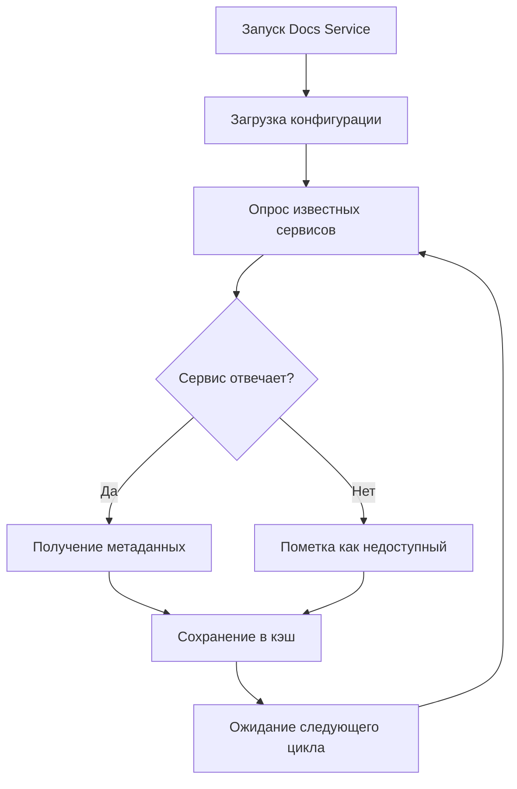
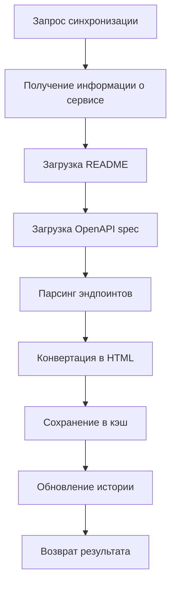

# 🚀 АВТОМАТИЧЕСКАЯ СИСТЕМА ДОКУМЕНТАЦИИ МИКРОСЕРВИСОВ

## 📋 ОБЗОР СИСТЕМЫ

Автоматическая система документации микросервисов позволяет:
- **Автоматически обнаруживать** новые микросервисы в системе
- **Синхронизировать документацию** из README файлов и API эндпоинтов
- **Публиковать документацию** через единый интерфейс
- **Поиск по всей документации** всех микросервисов
- **Мониторинг здоровья** и статуса сервисов

---

## 🏗️ АРХИТЕКТУРА СИСТЕМЫ

### Компоненты системы

```
┌─────────────────┐    ┌─────────────────┐    ┌─────────────────┐
│   Frontend      │    │   Docs Service  │    │  Microservices  │
│                 │    │                 │    │                 │
│ - UI Interface  │◄──►│ - Discovery     │◄──►│ - Health Check  │
│ - Search        │    │ - Sync Engine   │    │ - API Docs      │
│ - Navigation    │    │ - Cache         │    │ - README        │
└─────────────────┘    └─────────────────┘    └─────────────────┘
```

### Поток данных

1. **Обнаружение**: Docs Service опрашивает известные микросервисы
2. **Синхронизация**: Извлекает документацию из каждого сервиса
3. **Кэширование**: Сохраняет данные в Redis для быстрого доступа
4. **Публикация**: Предоставляет API для фронтенда
5. **Поиск**: Индексирует документацию для поиска

---

## 🔧 ТЕХНИЧЕСКАЯ РЕАЛИЗАЦИЯ

### 1. Модели данных

#### MicroserviceInfo
```typescript
interface MicroserviceInfo {
  name: string;                    // Уникальное имя сервиса
  display_name: string;            // Отображаемое имя
  description: string;             // Описание сервиса
  version: string;                 // Версия
  category: string;                // Категория (api, backend, frontend, etc.)
  status: 'healthy' | 'warning' | 'critical';
  base_url: string;                // Базовый URL сервиса
  health_endpoint: string;         // Эндпоинт проверки здоровья
  openapi_endpoint?: string;       // OpenAPI спецификация
  docs_endpoint?: string;          // Документация API
  readme_url?: string;             // URL к README файлу
}
```

#### ServiceDocumentation
```typescript
interface ServiceDocumentation {
  service: MicroserviceInfo;
  readme?: string;                 // HTML содержимое README
  api_docs: ServiceEndpoint[];     // Список API эндпоинтов
  architecture?: string;           // Архитектурная документация
  deployment?: string;             // Инструкции по развертыванию
  configuration?: Record<string, any>;
  examples: Record<string, any>[];
  troubleshooting?: string;
  changelog: any[];
  last_sync: string;               // Время последней синхронизации
}
```

### 2. API Эндпоинты

#### Обнаружение сервисов
```http
GET /api/v1/services/discover
```
**Ответ:**
```json
{
  "success": true,
  "message": "Discovered 5 services",
  "data": [
    {
      "name": "backend",
      "display_name": "Backend API",
      "description": "Основной API сервис",
      "version": "1.0.0",
      "category": "api",
      "status": "healthy",
      "base_url": "http://backend:8000",
      "health_endpoint": "/health"
    }
  ]
}
```

#### Синхронизация документации
```http
POST /api/v1/services/{service_name}/sync
```
**Ответ:**
```json
{
  "success": true,
  "message": "Service documentation sync completed",
  "data": {
    "service_name": "backend",
    "status": "completed",
    "sync_time": "2024-01-15T10:30:00Z",
    "files_processed": 3,
    "endpoints_discovered": 15
  }
}
```

#### Поиск по документации
```http
POST /api/v1/docs/search
```
**Тело запроса:**
```json
{
  "query": "authentication",
  "services": ["backend", "auth"],
  "categories": ["api"],
  "limit": 20,
  "offset": 0
}
```

### 3. Сервис обнаружения

#### MicroserviceDiscoveryService
```python
class MicroserviceDiscoveryService:
    def __init__(self):
        self.discovered_services = {}
        self.session = aiohttp.ClientSession()
        self.sync_history = []
    
    async def discover_services(self) -> List[MicroserviceInfo]:
        """Обнаружение доступных микросервисов"""
        services = []
        
        # Список известных сервисов для опроса
        known_services = [
            {"name": "backend", "base_url": "http://backend:8000"},
            {"name": "frontend", "base_url": "http://frontend:3000"},
            {"name": "llm-tuning", "base_url": "http://llm-tuning:8001"},
            {"name": "monitoring", "base_url": "http://monitoring:8002"},
            {"name": "testing", "base_url": "http://testing:8003"}
        ]
        
        for service_config in known_services:
            try:
                service_info = await self._discover_service(service_config)
                if service_info:
                    services.append(service_info)
                    self.discovered_services[service_info.name] = service_info
            except Exception as e:
                logger.error(f"Failed to discover {service_config['name']}: {e}")
        
        return services
    
    async def _discover_service(self, config: dict) -> Optional[MicroserviceInfo]:
        """Обнаружение конкретного сервиса"""
        base_url = config["base_url"]
        
        # Проверка здоровья сервиса
        health_url = f"{base_url}/health"
        try:
            async with self.session.get(health_url, timeout=5) as response:
                if response.status == 200:
                    health_data = await response.json()
                    
                    return MicroserviceInfo(
                        name=config["name"],
                        display_name=health_data.get("service_name", config["name"]),
                        description=health_data.get("description", ""),
                        version=health_data.get("version", "unknown"),
                        category=health_data.get("category", "unknown"),
                        status="healthy",
                        base_url=base_url,
                        health_endpoint="/health",
                        openapi_endpoint="/openapi.json",
                        docs_endpoint="/docs"
                    )
        except Exception as e:
            logger.warning(f"Service {config['name']} not responding: {e}")
            return None
```

### 4. Сервис синхронизации

#### DocumentSyncService
```python
class DocumentSyncService:
    async def sync_service_documentation(self, service_name: str) -> DocumentationSync:
        """Синхронизация документации сервиса"""
        discovery = self.discovered_services.get(service_name)
        if not discovery:
            raise ValueError(f"Service {service_name} not found")
        
        sync_result = DocumentationSync(
            service_name=service_name,
            status="in_progress",
            start_time=datetime.utcnow(),
            files_processed=0,
            endpoints_discovered=0
        )
        
        try:
            # Загрузка README
            readme_content = await self._fetch_readme(discovery)
            
            # Загрузка API документации
            api_docs = await self._fetch_api_docs(discovery)
            
            # Создание объекта документации
            service_doc = ServiceDocumentation(
                service=discovery,
                readme=readme_content,
                api_docs=api_docs,
                last_sync=datetime.utcnow().isoformat()
            )
            
            # Сохранение в кэш
            await self._save_documentation(service_name, service_doc)
            
            sync_result.status = "completed"
            sync_result.files_processed = 2  # README + API docs
            sync_result.endpoints_discovered = len(api_docs)
            
        except Exception as e:
            sync_result.status = "failed"
            sync_result.error = str(e)
            logger.error(f"Sync failed for {service_name}: {e}")
        
        sync_result.end_time = datetime.utcnow()
        self.sync_history.append(sync_result)
        
        return sync_result
    
    async def _fetch_readme(self, discovery: MicroserviceInfo) -> Optional[str]:
        """Загрузка README файла"""
        readme_urls = [
            f"{discovery.base_url}/readme",
            f"{discovery.base_url}/docs/readme",
            f"{discovery.base_url}/api/v1/docs/readme"
        ]
        
        for url in readme_urls:
            try:
                async with self.session.get(url, timeout=10) as response:
                    if response.status == 200:
                        data = await response.json()
                        if data.get("success") and data.get("data", {}).get("content"):
                            return self._convert_markdown_to_html(data["data"]["content"])
            except Exception:
                continue
        
        return None
    
    async def _fetch_api_docs(self, discovery: MicroserviceInfo) -> List[ServiceEndpoint]:
        """Загрузка API документации"""
        if not discovery.openapi_endpoint:
            return []
        
        try:
            openapi_url = f"{discovery.base_url}{discovery.openapi_endpoint}"
            async with self.session.get(openapi_url, timeout=10) as response:
                if response.status == 200:
                    openapi_data = await response.json()
                    return self._parse_openapi_spec(openapi_data)
        except Exception as e:
            logger.error(f"Failed to fetch API docs for {discovery.name}: {e}")
        
        return []
```

---

## 🎨 ФРОНТЕНД ИНТЕГРАЦИЯ

### 1. Компонент MicroservicesDocs

```typescript
const MicroservicesDocs: React.FC = () => {
  const [selectedService, setSelectedService] = useState<string | null>(null);
  const [serviceDocs, setServiceDocs] = useState<ServiceDocumentation | null>(null);
  
  const { services, discoverServices, syncServiceDocumentation } = useMicroservices();
  
  // Группировка сервисов по категориям
  const groupedServices = services.reduce((acc, service) => {
    const category = service.category || 'other';
    if (!acc[category]) acc[category] = [];
    acc[category].push(service);
    return acc;
  }, {} as Record<string, Microservice[]>);
  
  return (
    <div className="grid grid-cols-1 lg:grid-cols-4 gap-6">
      {/* Список сервисов */}
      <div className="lg:col-span-1">
        {Object.entries(groupedServices).map(([category, services]) => (
          <div key={category}>
            <h3>{category}</h3>
            {services.map(service => (
              <div 
                key={service.name}
                onClick={() => setSelectedService(service.name)}
                className={selectedService === service.name ? 'selected' : ''}
              >
                {service.display_name}
              </div>
            ))}
          </div>
        ))}
      </div>
      
      {/* Документация сервиса */}
      <div className="lg:col-span-3">
        {serviceDocs && (
          <div>
            <h2>{serviceDocs.service.display_name}</h2>
            <div dangerouslySetInnerHTML={{ __html: serviceDocs.readme }} />
            {/* API документация */}
            {serviceDocs.api_docs.map(endpoint => (
              <div key={endpoint.path}>
                <span className="method">{endpoint.method}</span>
                <code>{endpoint.path}</code>
                <p>{endpoint.description}</p>
              </div>
            ))}
          </div>
        )}
      </div>
    </div>
  );
};
```

### 2. Хук useMicroservices

```typescript
export const useMicroservices = () => {
  const [services, setServices] = useState<Microservice[]>([]);
  const [loading, setLoading] = useState(false);
  const [error, setError] = useState<string | null>(null);

  const discoverServices = useCallback(async () => {
    setLoading(true);
    try {
      const response = await fetch('/api/v1/services/discover');
      const data = await response.json();
      setServices(data.data || []);
    } catch (err) {
      setError(err instanceof Error ? err.message : 'Unknown error');
    } finally {
      setLoading(false);
    }
  }, []);

  const syncServiceDocumentation = useCallback(async (serviceName: string) => {
    try {
      await fetch(`/api/v1/services/${serviceName}/sync`, { method: 'POST' });
      await discoverServices(); // Обновляем список
    } catch (err) {
      setError(err instanceof Error ? err.message : 'Unknown error');
    }
  }, [discoverServices]);

  return {
    services,
    loading,
    error,
    discoverServices,
    syncServiceDocumentation
  };
};
```

---

## 🔄 ПРОЦЕСС СИНХРОНИЗАЦИИ

### 1. Автоматическое обнаружение



### 2. Синхронизация документации



---

## 📊 МОНИТОРИНГ И МЕТРИКИ

### Метрики системы

```python
# Метрики для Prometheus
DOCUMENTATION_SYNC_DURATION = Histogram(
    'documentation_sync_duration_seconds',
    'Time spent syncing documentation',
    ['service_name', 'status']
)

DOCUMENTATION_SYNC_SUCCESS = Counter(
    'documentation_sync_success_total',
    'Number of successful documentation syncs',
    ['service_name']
)

DOCUMENTATION_SYNC_FAILURES = Counter(
    'documentation_sync_failures_total',
    'Number of failed documentation syncs',
    ['service_name', 'error_type']
)

SERVICES_DISCOVERED = Gauge(
    'services_discovered_total',
    'Number of discovered services',
    ['category', 'status']
)
```

### Алерты

```yaml
# resource_alerts.yml
groups:
  - name: documentation_alerts
    rules:
      - alert: DocumentationSyncFailed
        expr: documentation_sync_failures_total > 0
        for: 5m
        labels:
          severity: warning
        annotations:
          summary: "Documentation sync failed for {{ $labels.service_name }}"
          description: "Service {{ $labels.service_name }} documentation sync has failed"
      
      - alert: NoServicesDiscovered
        expr: services_discovered_total == 0
        for: 10m
        labels:
          severity: critical
        annotations:
          summary: "No services discovered"
          description: "Documentation service cannot discover any microservices"
```

---

## 🚀 РАЗВЕРТЫВАНИЕ

### 1. Конфигурация Docker Compose

```yaml
# docker-compose.yml
services:
  docs-service:
    build:
      context: ./docs
      dockerfile: Dockerfile
    ports:
      - "8004:8000"
    environment:
      - REDIS_URL=redis://redis:6379
      - LOG_LEVEL=INFO
      - DISCOVERY_INTERVAL=300  # 5 минут
      - SYNC_TIMEOUT=60
    volumes:
      - ./docs/static:/app/static
    depends_on:
      - redis
      - backend
      - frontend
      - llm-tuning
    deploy:
      resources:
        limits:
          cpus: '0.347'
          memory: 433Mi
        reservations:
          cpus: '0.174'
          memory: 217Mi
```

### 2. Настройка nginx

```nginx
# nginx.conf
server {
    listen 80;
    server_name localhost;
    
    # Проксирование к docs service
    location /api/v1/services/ {
        proxy_pass http://docs-service:8000;
        proxy_set_header Host $host;
        proxy_set_header X-Real-IP $remote_addr;
    }
    
    # Проксирование к docs service для поиска
    location /api/v1/docs/search {
        proxy_pass http://docs-service:8000;
        proxy_set_header Host $host;
        proxy_set_header X-Real-IP $remote_addr;
    }
}
```

---

## 🔧 НАСТРОЙКА МИКРОСЕРВИСОВ

### Требования к микросервисам

Каждый микросервис должен предоставлять:

#### 1. Health Check эндпоинт
```python
@app.get("/health")
async def health_check():
    return {
        "status": "healthy",
        "service_name": "backend",
        "description": "Основной API сервис",
        "version": "1.0.0",
        "category": "api",
        "timestamp": datetime.utcnow().isoformat()
    }
```

#### 2. README эндпоинт (опционально)
```python
@app.get("/api/v1/docs/readme")
async def get_readme():
    readme_content = """
    # Backend API
    
    Основной API сервис для обработки запросов.
    
    ## Установка
    
    ```bash
    pip install -r requirements.txt
    ```
    
    ## Запуск
    
    ```bash
    uvicorn main:app --host 0.0.0.0 --port 8000
    ```
    """
    
    return {
        "success": True,
        "data": {
            "content": readme_content,
            "format": "markdown",
            "last_updated": datetime.utcnow().isoformat()
        }
    }
```

#### 3. OpenAPI спецификация
```python
# FastAPI автоматически генерирует OpenAPI spec
app = FastAPI(
    title="Backend API",
    description="Основной API сервис",
    version="1.0.0",
    docs_url="/docs",
    redoc_url="/redoc"
)
```

---

## 📈 ПЛАНЫ РАЗВИТИЯ

### Phase 1: Базовая функциональность ✅
- [x] Обнаружение микросервисов
- [x] Синхронизация README
- [x] Парсинг OpenAPI спецификаций
- [x] Базовый UI для просмотра документации

### Phase 2: Расширенная функциональность 🚧
- [ ] Поиск по документации
- [ ] Версионирование документации
- [ ] Экспорт в PDF/HTML
- [ ] Интеграция с Git для отслеживания изменений

### Phase 3: Продвинутые возможности 📋
- [ ] Автоматическая генерация диаграмм архитектуры
- [ ] Интеграция с CI/CD для автоматической публикации
- [ ] Система комментариев и обсуждений
- [ ] Аналитика использования документации

### Phase 4: AI-функции 🤖
- [ ] Автоматическое обновление документации на основе изменений кода
- [ ] Генерация примеров использования API
- [ ] Умный поиск с контекстом
- [ ] Автоматическое создание changelog

---

## 🛠️ УСТРАНЕНИЕ НЕПОЛАДОК

### Частые проблемы

#### 1. Сервис не обнаруживается
```bash
# Проверка доступности сервиса
curl -f http://service-name:port/health

# Проверка логов docs service
docker logs docs-service
```

#### 2. Документация не синхронизируется
```bash
# Принудительная синхронизация
curl -X POST http://docs-service:8000/api/v1/services/service-name/sync

# Проверка кэша
docker exec -it redis redis-cli KEYS "docs:*"
```

#### 3. Ошибки парсинга OpenAPI
```bash
# Проверка OpenAPI спецификации
curl http://service-name:port/openapi.json | jq .

# Валидация спецификации
curl -X POST http://docs-service:8000/api/v1/services/service-name/api-docs
```

---

## 📚 ДОПОЛНИТЕЛЬНЫЕ РЕСУРСЫ

- [FastAPI Documentation](https://fastapi.tiangolo.com/)
- [OpenAPI Specification](https://swagger.io/specification/)
- [Redis Documentation](https://redis.io/documentation)
- [Prometheus Monitoring](https://prometheus.io/docs/)
- [Docker Compose](https://docs.docker.com/compose/)

---

*Эта система обеспечивает автоматическое управление документацией всех микросервисов в едином интерфейсе, что значительно упрощает разработку и поддержку.* 